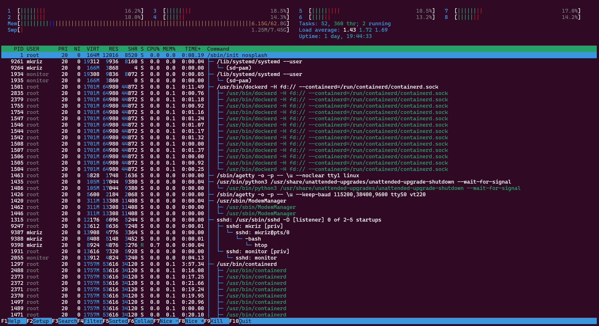
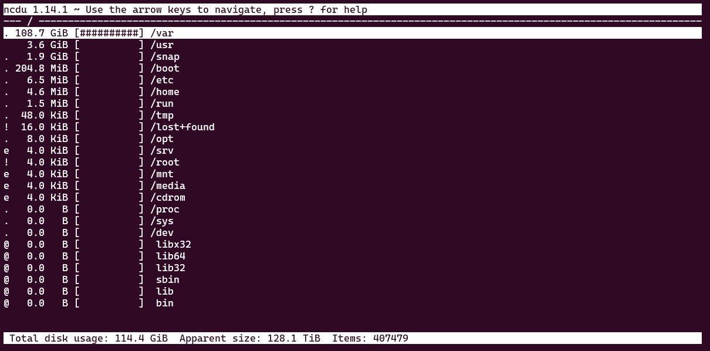

# Internal Tasks

## Verify Processor (CPU) specifications

The best way to obtain the internal data of the CPU is using the command:

```shell title="on your remote SSH session:"
lscpu
```

And the resulting information will be formatted roughly like this:

```text
Architecture:                    x86_64
CPU op-mode(s):                  32-bit, 64-bit
Byte Order:                      Little Endian
Address sizes:                   43 bits physical, 48 bits virtual
CPU(s):                          16
On-line CPU(s) list:             0-7
Off-line CPU(s) list:            8-15
Thread(s) per core:              1
Core(s) per socket:              8
Socket(s):                       1
NUMA node(s):                    1
Vendor ID:                       AuthenticAMD
CPU family:                      23
Model:                           113
Model name:                      AMD Ryzen 7 PRO 3700 8-Core Processor
Stepping:                        0
Frequency boost:                 enabled
CPU MHz:                         4182.837
CPU max MHz:                     3600.0000
CPU min MHz:                     2200.0000
BogoMIPS:                        7187.24
```

If this matches the information given by the hosting, then great!, now you can benchmark the speed of your CPU according to your final operations' characteristics. for that purpose you can install a specific program like [Phoronix](https://www.phoronix-test-suite.com), however you already have a smaller package already available in your system. You can try:

```shell title="on your remote SSH session:"
# To run all available tests
openssl speed

# To run tests specifically for BLAKE2b-512
openssl speed -evp blake2b512

# To run tests specifically for Ed25519-verify
openssl speed ed25519
```

Every type of test will yield a particular set of results, like the ones below:

```text
CPUINFO: OPENSSL_ia32cap=0x7ed8320b078bffff:0x40069c219c97a9

The 'numbers' are in 1000s of bytes per second processed.
type             16 bytes     64 bytes    256 bytes   1024 bytes   8192 bytes  16384 bytes
blake2b512       77737.54k   315060.87k   834346.04k  1128948.01k  1288414.67k  1294963.59k

                              sign    verify    sign/s verify/s
 253 bits EdDSA (Ed25519)   0.0000s   0.0001s  32438.3  12028.7
```

As this is a benchmark, you will need to compare these numbers with other machines configured to perform similar jobs as your server , and that comparison will likely help you predicting the performance of your machine.

It is now time to check how is the  CPU utilisation looking, and that is queried via the command:

```shell title="on your remote SSH session:"
sudo apt install htop
htop
```

This launches an interface in which you will be able to see every one of the active processes and their contribution to the CPU load:



:::tip
***htop***: remember you can quit by pressing the F10 key.
:::

## Verify Memory specifications

The quickest way to obtain the information about the installed memory is by command:

```shell title="on your remote SSH session:"
lsmem
```

And the resulting information will be formatted roughly like this:

```text
RANGE                                 SIZE  STATE REMOVABLE BLOCK
0x0000000000000000-0x000000107fffffff  66G online       yes  0-32

Memory block size:         2G
Total online memory:      66G
Total offline memory:      0B
```

Another command is:

```shell title="on your remote SSH session:"
free
```

resulting in:

```text
               total        used        free      shared  buff/cache   available
Mem:        65773828     6504404     8267284        2816    51002140    58537528
Swap:        1048568           0     1048568
```

and about the hardware details:

```shell title="on your remote SSH session:"
sudo lshw -C memory
```

to get some details similar to these:

```text
*-memory
      description: System Memory
      physical id: e
      slot: System board or motherboard
      size: 64GiB
      capabilities: ecc
      configuration: errordetection=multi-bit-ecc
    *-bank:0
        description: [empty]
    *-bank:1
        description: DIMM DDR4 Synchronous Unbuffered (Unregistered) 3200 MHz (0.3 ns)
        product: M391A4G43AB1-CWE
        vendor: Samsung
        physical id: 1
        serial: 023551B6
        slot: DIMM 1
        size: 32GiB
        width: 64 bits
        clock: 3200MHz (0.3ns)
    *-bank:2
        description: [empty]
    *-bank:3
        description: DIMM DDR4 Synchronous Unbuffered (Unregistered) 3200 MHz (0.3 ns)
        product: M391A4G43AB1-CWE
        vendor: Samsung
        physical id: 3
        serial: 02355289
        slot: DIMM 1
        size: 32GiB
        width: 64 bits
        clock: 3200MHz (0.3ns)
```

Feel free to use also ***dmidecode*** as well to see what is stored in the computer BIOS about the memory hardware.

You could install and run specific packages ***memtester*** or ***sysbench*** test for memory errors and read/write speeds too, however, some of these tests are made automatically during the Power-On Self-Test (POST) so they are not considered needed here.

## Verify Disk specifications

In a similar fashion, the below command shows the current list of blocks and disks in the system:

```shell title="on your remote SSH session:"
sudo lsblk
```

You get an output like this one:

```text
NAME        MAJ:MIN RM   SIZE RO TYPE  MOUNTPOINT
nvme0n1     259:0    0 894.3G  0 disk
├─nvme0n1p1 259:1    0     2M  0 part
├─nvme0n1p2 259:2    0   1.9G  0 part
│ └─md2       9:2    0   1.9G  0 raid1 /boot
├─nvme0n1p3 259:3    0   3.7G  0 part  [SWAP]
└─nvme0n1p4 259:4    0 888.7G  0 part
  └─md4       9:4    0 888.7G  0 raid1 /
nvme1n1     259:5    0 894.3G  0 disk
├─nvme1n1p1 259:6    0     2M  0 part
├─nvme1n1p2 259:7    0   1.9G  0 part
│ └─md2       9:2    0   1.9G  0 raid1 /boot
├─nvme1n1p3 259:8    0   3.7G  0 part  [SWAP]
└─nvme1n1p4 259:9    0 888.7G  0 part
  └─md4       9:4    0 888.7G  0 raid1 /
```

Feel free to play with ***lshw*** and ***dmidecode*** to see the hardware details of the installed disks.

Now for the performance tests, you could also use some basic utilities commonly installed in Ubuntu by default, like ***hdparm*** and ***dd***, or follow the recommendation and go to install the following tool:

```shell title="on your remote SSH session:"
sudo apt install fio
```

and use it to perform many type of test, according to your needs:

```shell title="on your remote SSH session:"
# Random read & write performance, 75%:25% mix
sudo fio --randrepeat=1 --ioengine=libaio --direct=1 --gtod_reduce=1 --name=test --filename=random_read_write.fio --bs=4k --iodepth=64 --size=4G --readwrite=randrw --rwmixread=75

# Random read performance
sudo fio --randrepeat=1 --ioengine=libaio --direct=1 --gtod_reduce=1 --name=test --filename=random_read.fio --bs=4k --iodepth=64 --size=4G --readwrite=randread

# Random write performance
sudo fio --randrepeat=1 --ioengine=libaio --direct=1 --gtod_reduce=1 --name=test --filename=random_write.fio --bs=4k --iodepth=64 --size=4G --readwrite=randwrite
```

These will be a sample the results:

```text
test: (groupid=0, jobs=1): err= 0: pid=4760: Thu Mar  2 13:23:28 2017
  read : io=7884.0KB, bw=864925B/s, iops=211, runt=  9334msec
  write: io=2356.0KB, bw=258468B/s, iops=63, runt=  9334msec
  cpu          : usr=0.46%, sys=2.35%, ctx=2289, majf=0, minf=29
  IO depths    : 1=0.1%, 2=0.1%, 4=0.2%, 8=0.3%, 16=0.6%, 32=1.2%, >=64=97.5%
     submit    : 0=0.0%, 4=100.0%, 8=0.0%, 16=0.0%, 32=0.0%, 64=0.0%, >=64=0.0%
     complete  : 0=0.0%, 4=100.0%, 8=0.0%, 16=0.0%, 32=0.0%, 64=0.1%, >=64=0.0%
     issued    : total=r=1971/w=589/d=0, short=r=0/w=0/d=0, drop=r=0/w=0/d=0
     latency   : target=0, window=0, percentile=100.00%, depth=64

Run status group 0 (all jobs):
   READ: io=7884KB, aggrb=844KB/s, minb=844KB/s, maxb=844KB/s, mint=9334msec, maxt=9334msec
  WRITE: io=2356KB, aggrb=252KB/s, minb=252KB/s, maxb=252KB/s, mint=9334msec, maxt=9334msec

Disk stats (read/write):
    dm-2: ios=1971/589, merge=0/0, ticks=454568/120101, in_queue=581406, util=98.44%, aggrios=1788/574, aggrmerge=182/15, aggrticks=425947/119120, aggrin_queue=545252, aggrutil=98.48%
  sda: ios=1788/574, merge=182/15, ticks=425947/119120, in_queue=545252, util=98.48%
```

Please take a look at [this great article](https://medium.com/@krisiasty/nvme-storage-verification-and-benchmarking-49b026786297) for more information

In regards to the utilisation of the disks, here there are a couple of commands which may prove useful in understanding which of the directories are consuming the most of the available space

```shell title="on your remote SSH session:"
sudo du -ah / | sort -h
```

and you get a ordered list of directories by size.

```text
(...)
472K    /usr/lib/firmware/ath10k/QCA99X0/hw2.0/firmware-5.bin
472K    /usr/lib/firmware/vxge/X3fw-pxe.ncf
472K    /usr/lib/python3.10/pydoc_data/__pycache__
(...)
371G    /var/lib
373G    /var
378G    /
```

Or you could install a more visual appealing tool to have similar insight into the biggest directories

```shell title="on your remote SSH session:"
sudo apt install ncdu
cd /
ncdu
```



:::tip
***ncdu***: remember you can quit by pressing the 'Q' key.
:::

A final handy command to check storage remaining space is:

```shell title="on your remote SSH session:"
sudo df -h
```

It gives the following type of report:

```text
Filesystem      Size  Used Avail Use% Mounted on
tmpfs           3.0G  1.3M  3.0G   1% /run
/dev/sda3       1.2T  377G  742G  34% /
tmpfs            15G     0   15G   0% /dev/shm
tmpfs           5.0M     0  5.0M   0% /run/lock
/dev/sda2       2.0G  163M  1.7G   9% /boot
tmpfs           3.0G  4.0K  3.0G   1% /run/user/1000
```
