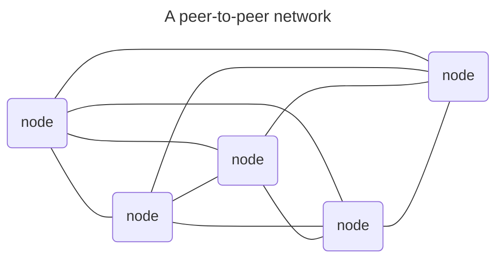
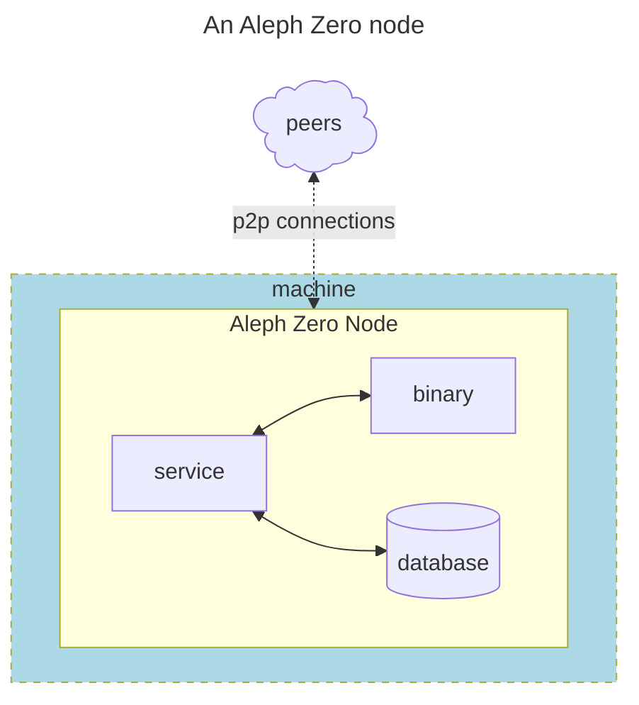
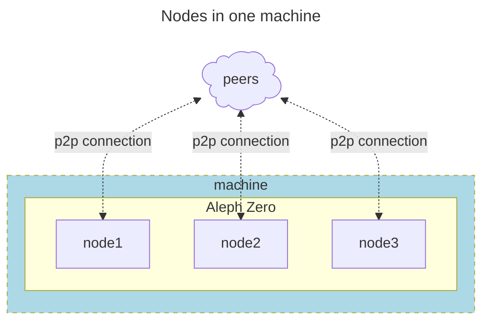

    
# Generic Nodes

Aleph Zero, in a similar to many other decentralized ledger technologies, uses a peer-to-peer (p2p) network topology. This arrangement allows the flexible addition or removal of individual nodes with minimal affectation to the operations of the whole network, that is, the system is inherently more resilient than alternative solutions.



## What is a Node

We can see every node as a point of connection between peers in a network.

In the Aleph Zero ecosystem, the nodes serve a common purpose (interconnection) but can also serve specific objectives: as either validators, bootnodes, archivists, etc. some could even mix a couple of these goals at the same time (e.g. archivist + bootnode functions in the same node is not uncommon).

:::warning
It is recommended that a node acting as a validator is not tasked additional functions as bootnode or archivists, to avoid it become too overwhelmed with these additional functions in detriment of the most important task of validating the blocks for the blockchain
:::

If you see an Aleph Zero node closely, you will see the following components:



In this diagram you isolated one of the nodes from the network, which is now drawn as a "cloud" of **peers** on the top of the diagram. From these peers, several **p2p connections** will be maintained for the **Aleph Zero Node** that is running inside the **machine**.

And the node is actually a program (a **binary**) that is being executed with the help of a **service** provided by the machine's operating system, and all activities of this node are stored to / retrieved from a local **database**.

We can also see that the node is an abstract concept, an instance of a program that is running in the RAM of a computer, so if it wasn't for the local database, the node was completely volatile. Finally, see that given the ephemeral concept of the node allows for running several nodes hosted in the same machine:



:::warning
Hosting several nodes in one machine is often reserved for test networks, but not recommended for validators of live blockchains (e.g.mainnet).
:::

## Working components of a Node:

In the following subtitles you will configure the necessary aspects of your generic node, these will be the exact same aspects needed for a validator, bootnode or  archivist node, but for the fine details on the operations of those kind of nodes, please refer to the relevant chapters.

- **Firewall ports**: Open only what is needed.
- **Executing User**: do not use `root`.
- **Executable Binary**: where is the program?.
- **Blockchain Database**: where to store local copy of the blockchain.
- **Blockchain Specifications**: what network do you want to connect to?
- **`systemd` Service**: Putting it all together

## Firewall Ports

An Aleph Zero generic node, running alone in one machine, uses the TCP port 30333 as default, so make sure you have it open for incoming connections.

That means in the most cases:

1. Open the ports at the router (or ISP) level --> please refer to your router (or ISP) instructions.
2. Open the ports at the machine level:

If you followed the instructions of the [servers](../../01-server/index.md) chapter, now you only need to open the additional port with `ufw`:

```shell
# Open the p2p port
sudo ufw allow proto tcp from any to any port 30333 comment 'p2p port'
# Check the port is open and the firewall is enabled
sudo ufw status verbose
```

and the output should look like

```text
Status: active
Logging: on (low)
Default: deny (incoming), allow (outgoing), disabled (routed)
New profiles: skip

To                         Action      From
--                         ------      ----
22/tcp                     ALLOW IN    200.xxx.xxx.12             # SSH port
30333/tcp                  ALLOW IN    Anywhere                   # p2p port
```

## Executing User

It is highly advisable not to use the `root` user to run any services, this is in line with the best practice of always using the method of least privilege rather than least resistance.

So, lets create a new user dedicated only to run Aleph Zero services:

```shell
# create a limited user and group to run Aleph Zero
sudo adduser --disabled-login --no-create-home -gecos "Aleph Zero" azero
# Check that the user now exists
sudo tail /etc/passwd
```

The results should look like:

```text
messagebus:x:101:101::/nonexistent:/usr/sbin/nologin
syslog:x:102:102::/nonexistent:/usr/sbin/nologin
systemd-resolve:x:991:991:systemd Resolver:/:/usr/sbin/nologin
uuidd:x:103:103::/run/uuidd:/usr/sbin/nologin
(...)
azero:x:1003:1003:Aleph Zero,,,:/home/azero:/usr/sbin/nologin
```

## Executable Binary

Now let's install the program. As a convention, we will use the Linux standard directory `/usr/local/bin` to store our executable (binary) files.

One benefit of using this directory, is that Ubuntu already lists it as part of the environment paths to search when executing commands. Thus, we do not need to memorize the full path when invoking.

You can find the latest binary at the[ `aleph-node` github repository](https://github.com/aleph-zero-foundation/aleph-node/releases) of the Aleph Zero foundation.

:::danger
Please note that until the migration process is completed, the latest binary will still be available from the subcontractor's repository.
The next commands will be updated as soon as suitable.
:::

```shell
# Change to the (bin)aries directory
cd /usr/local/bin

# download the binary
sudo wget https://github.com/Cardinal-Cryptography/aleph-node/releases/download/r-15.2.0/aleph-node-36ed9fa-linux-amd64.tar.gz

# (optional) download and print the checksum declaration
sudo wget https://github.com/Cardinal-Cryptography/aleph-node/releases/download/r-15.2.0/checksums-36ed9fa-linux-amd64.tar.gz.SHA256.txt
cat checksums-36ed9fa-linux-amd64.tar.gz.SHA256.txt

# (optional) calculate the actual checksum of the downloaded binary
# visually check that both checksums match before progressing to next steps
sudo sha256sum aleph-node-36ed9fa-linux-amd64.tar.gz

# Unzip the binary file
sudo tar -xvzf aleph-node-36ed9fa-linux-amd64.tar.gz

# Assign ownership to the custom user and amend file permissions
sudo chown azero:azero aleph-node
sudo chmod 755 aleph-node
```

If you want to know how does the visual checks for the checksums look like, please see the next terminal output, where it is evident that the intended file `aleph-node-36ed9fa-linux-amd64.tar.gz` throws the exact checksum as declared but the Github repository, so at least the download was reliably done:

```shell
$ cat checksums-36ed9fa-linux-amd64.tar.gz.SHA256.txt
b48fe81dde782ca310e237f56fac25a8aa8ad4ebc191d5f91440a760a27eb7ad aleph-runtime-36ed9fa.tar.gz
c5e11ba6f74ea66906912731661803f85410f446cbee2f5c592877da3b4e0d7e aleph-node-36ed9fa-linux-amd64.tar.gz

$ sudo sha256sum aleph-node-36ed9fa-linux-amd64.tar.gz
c5e11ba6f74ea66906912731661803f85410f446cbee2f5c592877da3b4e0d7e  aleph-node-36ed9fa-linux-amd64.tar.gz
```

## Blockchain Database

It is time now to create the directories where the local database will be stored.

Once again, following best practices, we will use the Linux standard `/var/lib` directory for that, inside we will start the organization by creating one folder with the same name of the application or binary (i.e. `aleph-node`) and nested inside another folder with the name of our node (e.g. `azero1`).

```shell
# Create all (parent) directories until the most nested one
sudo mkdir -p /var/lib/aleph-node/azero1
# Assign ownership (recursively) to the custom user
sudo chown -R azero:azero /var/lib/aleph-node
```

## Blockchain Specifications

The binary above is a program, and, as such, it can take parameters which can change its behavior.

One of the most important of these parameters is the blockchain specifications, often called the `chainspec` file. This file contains key information to be able to connect to the correct network and that such network starts with the correct arguments or values for its "state".

Aleph Zero Foundation manages two public networks: the `mainnet` and the `testnet`. Apart of these, there are several other private networks used for development, you cannot connect to these.

The location of the corresponding `chainspec` files is the [`aleph-node` Github repository](https://github.com/aleph-zero-foundation/aleph-node/tree/main/bin/node/src/resources) of the Aleph Zero Foundation  

:::danger
Please note that until the migration process is completed, the latest chainspec files will still be available from the subcontractor's repository.
The bootnodes indicated in these files are outdated and may trigger log warnings. The next commands will be updated as soon as suitable.
:::

```shell
# change directory to the database
cd /var/lib/aleph-node/azero1
# Download the chainspec for the relevant network (i.e. mainnet)
sudo wget https://raw.githubusercontent.com/Cardinal-Cryptography/aleph-node/refs/tags/r-15.2.0/bin/node/src/resources/mainnet_chainspec.json
# Assign ownership to the custom user and amend file permissions
sudo chown azero:azero mainnet_chainspec.json
sudo chmod 644 mainnet_chainspec.json
```

## `systemd` Service

Finally, the node is ready to receive the final instruction on how to start running the node.

In Ubuntu linux, this is most easily achieved via a `systemd` service. These are specified via a `.service` configuration file in the `/etc/systemd/system` directory.

Let's create our file like this:

```shell
# Create a new azero1.service file
sudo nano /etc/systemd/system/azero1.service
```

The minimal node configuration to run and Aleph Zero node in mainnet would look like this one below, feel free to paste in your `azero1.service` file:

```systemd title="/etc/systemd/system/azero1.service"
[Unit]
Description=Aleph Zero Mainnet Node
After=network-online.target
Wants=network-online.target

[Service]
User=azero
Group=azero
ExecStart=/usr/local/bin/aleph-node \
  --name MY_AZERO_NODE \
  --base-path '/var/lib/aleph-node/azero1' \
  --chain /var/lib/aleph-node/azero1/mainnet_chainspec.json \
  --no-backup \
  --no-telemetry \
  --no-prometheus \
  --bootnodes "/dns4/vnode.alephzero.org/tcp/30333/p2p/12D3KooW9qrAFhZA5LWAUpXcQjAEkgt45mzejQNekE9RfJ2Rj7wH /ip4/15.204.109.229/tcp/30333/p2p 12D3KooWSW8Wg81hjowRLd2eCHXtPna3reGUK8iaRJz57jWbSYik /dns/azero.gatotech.network/tcp/33600/p2p/12D3KooWF5ZVJngM62dAFeVLeEY81ZvtRPoH3QTvLsTheCEgyfkW /dns/azero.gatotech.network/tcp/34600/ws/p2p/12D3KooWF5ZVJngM62dAFeVLeEY81ZvtRPoH3QTvLsTheCEgyfkW /dns/azero.gatotech.network/tcp/35600/wss/p2p/12D3KooWF5ZVJngM62dAFeVLeEY81ZvtRPoH3QTvLsTheCEgyfkW"

Restart=always
RestartSec=120

[Install]
WantedBy=multi-user.target
```

This configuration uses most of the default settings for an Aleph Zero node and avoid running additional microservices (e.g. prometheus.)

Once this file is saved to storage, you can control it with the following commands:

```shell
# Start the azero1 service
sudo systemctl start azero1
# Query the status of  the azero1 service
sudo systemctl status azero1
# Stop the azero1 service
sudo systemctl stop azero1
# Enable the autostart of the azero1 service after reboots
sudo systemctl enable azero1
# Disable the autostart of the azero1 service after reboots
sudo systemctl disable azero1
# Show continuously the logs of the azero1 service, starting with the last 100 entries
sudo journalctl -fn 100 -u azero1
```

for your reference, this is what the `sudo systemctl status azero1` returns:

```text
● azero1.service - Aleph Zero Mainnet Node
     Loaded: loaded (/etc/systemd/system/azero1.service; enabled; preset: enabled)
     Active: active (running) since Mon 2025-10-06 13:47:01 UTC; 1 week 2 days ago
   Main PID: 1271 (aleph-node)
      Tasks: 46 (limit: 75991)
     Memory: 5.1G (peak: 5.5G swap: 16.0K swap peak: 16.0K)
        CPU: 7h 16min 6.667s
     CGroup: /system.slice/azero1.service
             └─1271 /usr/local/bin/aleph-node --name MY_AZERO_NODE --base-path /var/lib/aleph-node/azero1 --chain /var/lib/aleph-node/azero1/chainspec.json

Oct 15 15:57:57 my_machine aleph-node[1271]: 2025-10-15 15:57:57 ✨ Imported #123479190 (0x2ba2…dd2c)
Oct 15 15:57:58 my_machine aleph-node[1271]: 2025-10-15 15:57:58 ✨ Imported #123479191 (0x55f6…bf4a)
Oct 15 15:57:59 my_machine aleph-node[1271]: 2025-10-15 15:57:59 ✨ Imported #123479192 (0xf0c0…0e5f)
(...)
Oct 15 15:58:03 my_machine aleph-node[1271]: 2025-10-15 15:58:03 Clique Network status: not maintaining any connections;
Oct 15 15:58:03 my_machine aleph-node[1271]: 2025-10-15 15:58:03 Imported: #123479196 (0xff21…96ba), finalized: #123479194 (0xda3b…efb8), favourite: #123479196 (0xff21…96ba).
Oct 15 15:58:04 my_machine aleph-node[1271]: 2025-10-15 15:58:04 ✨ Imported #123479197 (0x62be…cbe6)
lines 1-20/20 (END)
```

and you can exit back to the system prompt pressing the `Q` key.

On the other hand, the output of the `sudo journalctl -fn 100 -u azero1` command should look like this right after the node starts:

```text
Oct 15 16:01:49 my_machine systemd[1]: Started azero1.service - Aleph Zero Mainnet Node.
Oct 15 16:01:50 my_machine aleph-node[430050]: 2025-10-15 16:01:50 Aleph Node
Oct 15 16:01:50 my_machine aleph-node[430050]: 2025-10-15 16:01:50 ✌️  version 15.2.0-36ed9faa3fd
Oct 15 16:01:50 my_machine aleph-node[430050]: 2025-10-15 16:01:50 ❤️  by Cardinal:Aleph Zero Foundation, 2021-2025
Oct 15 16:01:50 my_machine aleph-node[430050]: 2025-10-15 16:01:50 📋 Chain specification: Aleph Zero
Oct 15 16:01:50 my_machine aleph-node[430050]: 2025-10-15 16:01:50 🏷  Node name: MY_AZERO_NODE
Oct 15 16:01:50 my_machine aleph-node[430050]: 2025-10-15 16:01:50 👤 Role: FULL
Oct 15 16:01:50 my_machine aleph-node[430050]: 2025-10-15 16:01:50 💾 Database: RocksDb at /var/lib/aleph-node/azero1/chains/mainnet/db/full
Oct 15 16:01:50 my_machine aleph-node[430050]: 2025-10-15 16:01:50 Running as a non-validator node, setting dummy addressing configuration.
Oct 15 16:01:50 my_machine aleph-node[430050]: 2025-10-15 16:01:50 Using default protocol ID "sup" because none is configured in the chain specs
Oct 15 16:01:50 my_machine aleph-node[430050]: 2025-10-15 16:01:50 🏷  Local node identity is: 12D3KooWBd1hpWeQkojuzYtYt1R8DB7j6z3mLu4mi6kxxxxx
Oct 15 16:01:50 my_machine aleph-node[430050]: 2025-10-15 16:01:50 💻 Operating system: linux
Oct 15 16:01:50 my_machine aleph-node[430050]: 2025-10-15 16:01:50 💻 CPU architecture: x86_64
Oct 15 16:01:50 my_machine aleph-node[430050]: 2025-10-15 16:01:50 💻 Target environment: gnu
Oct 15 16:01:50 my_machine aleph-node[430050]: 2025-10-15 16:01:50 💻 CPU: AMD Ryzen 9 7950X 16-Core Processor
Oct 15 16:01:50 my_machine aleph-node[430050]: 2025-10-15 16:01:50 💻 CPU cores: 16
Oct 15 16:01:50 my_machine aleph-node[430050]: 2025-10-15 16:01:50 💻 Memory: 63404MB
Oct 15 16:01:50 my_machine aleph-node[430050]: 2025-10-15 16:01:50 💻 Kernel: 6.8.0-85-generic
Oct 15 16:01:50 my_machine aleph-node[430050]: 2025-10-15 16:01:50 💻 Linux distribution: Ubuntu 24.04.3 LTS
Oct 15 16:01:50 my_machine aleph-node[430050]: 2025-10-15 16:01:50 💻 Virtual machine: no
Oct 15 16:01:50 my_machine aleph-node[430050]: 2025-10-15 16:01:50 📦 Highest known block at #123479411
Oct 15 16:01:50 my_machine aleph-node[430050]: 2025-10-15 16:01:50 〽️ Prometheus exporter started at 0.0.0.0:9618
Oct 15 16:01:50 my_machine aleph-node[430050]: 2025-10-15 16:01:50 Running JSON-RPC server: addr=127.0.0.1:9947, allowed origins=["http://localhost:*", "http://127.0.0.1:*", "https://localhost:*", "https://127.0.0.1:*", "https://polkadot.js.org"]
Oct 15 16:01:50 my_machine aleph-node[430050]: 2025-10-15 16:01:50 Clique Network status: not maintaining any connections;
Oct 15 16:01:50 my_machine aleph-node[430050]: 2025-10-15 16:01:50 Switched to major sync state.
Oct 15 16:01:50 my_machine aleph-node[430050]: 2025-10-15 16:01:50 Imported: #123479411 (0x1352…cbd7), finalized: #123479409 (0x3d70…92f4), favourite: #123479411 (0x1352…cbd7).
Oct 15 16:01:50 my_machine aleph-node[430050]: 2025-10-15 16:01:50 Running session 137199.
Oct 15 16:01:51 my_machine aleph-node[430050]: 2025-10-15 16:01:51 🔍 Discovered new external address for our node: /ip4/100.201.xxx.xx/tcp/30333/p2p/12D3KooWBd1hpWeQkojuzYtYt1R8DB7j6z3mLu4mi6k99qvoHhr3
Oct 15 16:01:52 my_machine aleph-node[430050]: 2025-10-15 16:01:52 ✨ Imported #123479412 (0x4f57…bfc3)
Oct 15 16:01:52 my_machine aleph-node[430050]: 2025-10-15 16:01:52 ✨ Imported #123479413 (0x83e6…bf39)
Oct 15 16:01:52 my_machine aleph-node[430050]: 2025-10-15 16:01:52 ✨ Imported #123479414 (0xf6b8…494d)
Oct 15 16:01:52 my_machine aleph-node[430050]: 2025-10-15 16:01:52 ✨ Imported #123479415 (0xa557…84eb)
Oct 15 16:01:52 my_machine aleph-node[430050]: 2025-10-15 16:01:52 ✨ Imported #123479416 (0xb196…a2a3)
(...)
```

If you can see these logs progressing, you are syncing your database with the public blockchain!.. Congratulations!

You can now stop it and decide what do you want to do with this node, in the next chapter you will find information to change it to serve the network as a validator, a bootnode, or an archivist.

Godspeed!
