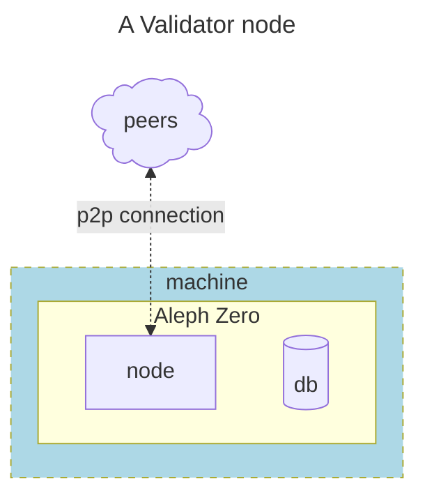

    
# Generic Nodes

## Working components of a Node:

In the following subtitles you will configure the necessary aspects of your validator node, these will be the exact same aspects needed for a bootnode or an archivist node (only  )

