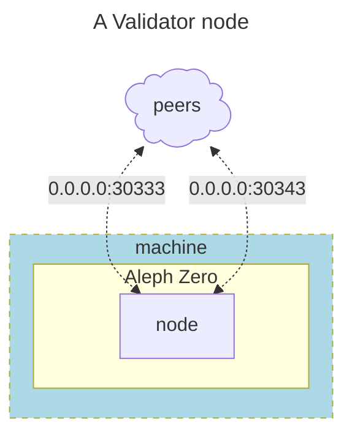

    
# Validators

A Validator node requires certain level of minimum recommended hardware that is shown below:

- **Processor**: any modern processor x86_64 (Intel Ice Lake or newer, or AMD Zen3 or newer).
- **Cores**: 8 cores at a frequency of at least 3GHz. Multithreading disabled.
- **Memory**:  32GB DDR4 RAM, preferably with error corrections (ECC).
- **Storage**: 256GB NVMe SSD (pruned blockchain database is currently around 110GB).
- **Network**: 100Mbps with low latency (less than 150ms to several peers).
- **Traffic**: 500GB/day, or unlimited if possible (current volume around 10TB/month).
- **Firewall**: ports 30333 and 30343 must be open for incoming connections.

:::info
These minimum requirements may increase when the chain gets more traffic due to improved adoption and transactional demand.
:::

## What is a validator node

A validator node is one of the most important building block of a blockchain network, in the Aleph Zero ecosystem, validators are in charge of both: the production and the finalization of blocks for the blockchain. Thus, it is of the utmost importance that every operator running validator nodes take their responsibility very seriously.

These nodes connect to others in the network via peer-to-peer (p2p) protocols, and validators connect to two (2x) separate networks of peers, including one exclusively reserved to authoritative (validator) nodes. Like in the diagram below:



## Configure Validator Service

The `systemd` service file needs to include all the configuration for the ports in the diagram above, as well as provide public advertisement of the addresses where the services will be available, this is done by specifying the following:

```bash
# Edit the systemd service file to add listening ports and protocols
sudo nano /etc/systemd/system/azero1.service
```

and enter the following sample content for an Aleph Zero validator

```systemd title="/etc/systemd/system/azero1.service"
[Unit]
Description=Aleph Zero Mainnet Node
After=network-online.target
Wants=network-online.target

[Service]
User=azero
Group=azero
ExecStart=/usr/local/bin/aleph-node \
  --validator \
  --name MY_AZERO_VALIDATOR \
  --base-path '/var/lib/aleph-node/azero1' \
  --chain /var/lib/aleph-node/azero1/chainspec.json \
  --node-key-file /var/lib/aleph-node/azero1/p2p_secret \
  --backup-path /var/lib/aleph-node/azero1/backup-stash \
  --port 30333 \
  --validator-port 30343 \
  --public-validator-addresses 181.200.200.xxx:30346 \
  --database paritydb \
  --enable-pruning \
  --state-pruning 8192 \
  --blocks-pruning archive-canonical \
  --telemetry-url 'wss://telemetry.azero.fans/submit/ 1' \
  --telemetry-url 'wss://telemetry.polkadot.io/submit/ 1' \
  --bootnodes "/dns4/vnode.alephzero.org/tcp/30333/p2p/12D3KooW9qrAFhZA5LWAUpXcQjAEkgt45mzejQNekE9RfJ2Rj7wH /ip4/15.204.109.229/tcp/30333/p2p/12D3KooWSW8Wg81hjowRLd2eCHXtPna3reGUK8iaRJz57jWbSYik /dns/azero.gatotech.network/tcp/33600/p2p/12D3KooWF5ZVJngM62dAFeVLeEY81ZvtRPoH3QTvLsTheCEgyfkW /dns/azero.gatotech.network/tcp/34600/ws/p2p/12D3KooWF5ZVJngM62dAFeVLeEY81ZvtRPoH3QTvLsTheCEgyfkW /dns/azero.gatotech.network/tcp/35600/wss/p2p/12D3KooWF5ZVJngM62dAFeVLeEY81ZvtRPoH3QTvLsTheCEgyfkW" \
  --wasm-execution Compiled \
  --pool-limit 100 \
  --unit-creation-delay 300 \
  --enable-log-reloading

Restart=always
RestartSec=120

[Install]
WantedBy=multi-user.target
```

Please note that this service file makes use of the following flags:

- `--state-pruning`: a typical value of *`8192`* is adequate for a validator, this is equivalent to state history of slightly more of 2h.
- `--sync`: the use of *`warp`* mode is supported for most bootnodes, make use of it and speed up the syncing time!
- The rest of the flags are there for convenience and performance.

:::danger
This guide is still under construction, please come back later
:::
