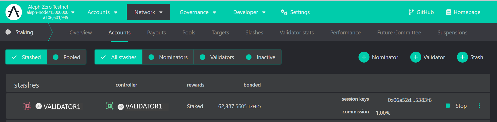

    
# Validators

A Validator node requires certain level of minimum recommended hardware that is shown below:

- **Processor**: any modern processor x86_64 (Intel Ice Lake or newer, or AMD Zen3 or newer).
- **Cores**: 8 cores at a frequency of at least 3GHz. Multithreading disabled.
- **Memory**:  32GB DDR4 RAM, preferably with error corrections (ECC).
- **Storage**: 256GB NVMe SSD (pruned blockchain database is currently around 110GB).
- **Network**: 100Mbps with low latency (less than 150ms to several peers).
- **Traffic**: 500GB/day, or unlimited if possible (current volume around 10TB/month).
- **Firewall**: ports 30333 and 30343 must be open for incoming connections.

:::info
These minimum requirements may increase when the chain gets more traffic due to improved adoption and transactional demand.
:::

## What is a validator node

A validator node is one of the most important building block of a blockchain network, in the Aleph Zero ecosystem, validators are in charge of both: the production and the finalization of blocks for the blockchain. Thus, it is of the utmost importance that every operator running validator nodes take their responsibility very seriously.

These nodes connect to others in the network via peer-to-peer (p2p) protocols, and validators connect to two (2x) separate networks of peers, including one exclusively reserved to authoritative (validator) nodes. Like in the diagram below:


## Open Validator port

We need to make sure that your ISP, your router and your machine all allow the incoming traffic on the new validator port 30343, so we proceed with the following

```shell
# Open the p2p port
sudo ufw allow proto tcp from any to any port 30343 comment 'Validator port'
# Check the port is open and the firewall is enabled
sudo ufw status verbose
```

and the output should look like

```text
Status: active
Logging: on (low)
Default: deny (incoming), allow (outgoing), disabled (routed)
New profiles: skip

To                         Action      From
--                         ------      ----
22/tcp                     ALLOW IN    200.xxx.xxx.12             # SSH port
30333/tcp                  ALLOW IN    Anywhere                   # p2p port
30343/tcp                  ALLOW IN    Anywhere                   # Validator port
```

## Configure Validator Service

The `systemd` service file needs to include all the configuration for the ports in the diagram above, as well as provide public advertisement of the addresses where the services will be available, this is done by specifying the following:

```bash
# Edit the systemd service file to add listening ports and protocols
sudo nano /etc/systemd/system/azero1.service
```

and enter the following sample content for an Aleph Zero validator

```systemd title="/etc/systemd/system/azero1.service"
[Unit]
Description=Aleph Zero Mainnet Node
After=network-online.target
Wants=network-online.target

[Service]
User=azero
Group=azero
ExecStart=/usr/local/bin/aleph-node \
  --validator \
  --name MY_AZERO_VALIDATOR \
  --base-path '/var/lib/aleph-node/azero1' \
  --chain /var/lib/aleph-node/azero1/mainnet_chainspec \
  --backup-path /var/lib/aleph-node/azero1/backup-stash \
  --port 30333 \
  --validator-port 30343 \
  --public-validator-addresses 181.200.200.xxx:30343 \
  --database paritydb \
  --enable-pruning \
  --state-pruning 8192 \
  --blocks-pruning archive-canonical \
  --telemetry-url 'wss://telemetry.azero.fans/submit/ 1' \
  --telemetry-url 'wss://telemetry.polkadot.io/submit/ 1' \
  --bootnodes "/dns4/vnode.alephzero.org/tcp/30333/p2p/12D3KooW9qrAFhZA5LWAUpXcQjAEkgt45mzejQNekE9RfJ2Rj7wH /ip4/15.204.109.229/tcp/30333/p2p/12D3KooWSW8Wg81hjowRLd2eCHXtPna3reGUK8iaRJz57jWbSYik /dns/azero.gatotech.network/tcp/33600/p2p/12D3KooWF5ZVJngM62dAFeVLeEY81ZvtRPoH3QTvLsTheCEgyfkW /dns/azero.gatotech.network/tcp/34600/ws/p2p/12D3KooWF5ZVJngM62dAFeVLeEY81ZvtRPoH3QTvLsTheCEgyfkW /dns/azero.gatotech.network/tcp/35600/wss/p2p/12D3KooWF5ZVJngM62dAFeVLeEY81ZvtRPoH3QTvLsTheCEgyfkW" \
  --sync warp \
  --wasm-execution Compiled \
  --pool-limit 100 \
  --unit-creation-delay 300 \
  --enable-log-reloading

Restart=always
RestartSec=120

[Install]
WantedBy=multi-user.target
```

Please note that this service file makes use of the following special flags:

- `--validator`: IMPORTANT! without this flag your node will not participate in consensus.
- `--state-pruning`: a typical value of *`8192`* is adequate for a validator, this is equivalent to state history of slightly more of 2h.
- `--database`: specifies that the database type `paritydb` will be used, this would make the node slightly more performant than the alternative `rocksdb`.
- The rest of the flags are there for convenience and performance.

## Create session keys

This validator node is now ready to receive session keys, which will be needed to declare its validation intentions on-chain, and will be the ones applied to every block block signature where it participates.

:::warning
The creation of session keys is a process that depends from the current runtime, so it is of utmost importance that the following commands are only executed once the node has fully synced to the current height of the blockchain
:::

The creation of these keys is performed against the RPC (Remote Procedure Call) port of the node itself. This port is not open to the exterior so you mustvme logged in the node's machine to execute it:

```shell
# Create session keys (IMPORTANT: Take note of the keys returned by this command)
sudo curl -H "Content-Type: application/json" -d '{"id":1, "jsonrpc":"2.0", "method": "author_rotateKeys", "params":[]}' http://localhost:9944
# Check that the keys exists in the appropriate directory
ll /var/lib/aleph-node/azero1/chains/mainnet/keystore
```

the results would look like this:

```shell
$sudo curl -H "Content-Type: application/json" -d '{"id":1, "jsonrpc":"2.0", "method": "author_rotateKeys", "params":[]}' http://localhost:9944
0x745d7b5d197592ee8xxxxxxxxxxxf9e2bb1928ca36d34f8f455dd95a7d4a505e78c1a2d946f6d0076xxxxxxxxxx904a90d610659dd275c3ef9d7cd070c637a41c

$ll /var/lib/aleph-node/azero1/chains/mainnet/keystore
total 16
drwxr-xr-x 2 azero azero 4096 Nov  8  2023 ./
drwxr-xr-x 5 azero azero 4096 Apr 19  2024 ../
-rwxr-xr-x 1 root  root    82 Nov  8  2023 616c70305e78c1a2d946f6d0076xxxxxxxxxxx90d610659dd275c3ef9d7cd070c637a41c*
-rwxr-xr-x 1 root  root    70 Nov  8  2023 61757261745d7b5d197592ee8xxxxxxxxxxxxxf9e2bb1928ca36d34f8f455dd95a7d4a50*
```

Note that two (2x) files were created (one is the ***AURA*** key for block production and the other is the ***ALEPH*** key for block finalization).

However, also note that they are owned by root and this may cause some access problems. In order to avoid these, let's change owner and set the permissions appropriately.

```shell
# Finally change ownership and permissions
chown -R azero:azero /var/lib/aleph-node/azero1/chains/mainnet/keystore
chmod 600 /var/lib/aleph-node/azero1/chains/mainnet/keystore/*
```

:::danger
It is very important that you take note of the session keys produced by the `author_rotatekeys` method, and that you keep it as secure as any other mission-critical password or passphrase. This information is highly sensitive.
:::

:::danger
Do not copy session keys between nodes, if any two nodes with the same session keys try to participate in consensus at the same time this may create a double-signature error, which is penalised with a hefty slash to you stake, and the stake of all your nominators.
:::

:::info
in case you lose or fail to secure your session keys, just delete these files from the node's database directory, and generate brand new keys again. This time, make sure you take note and store them securely
:::

## Add self-stake

Now the final step happens entirely on-chain so you need to go to the official wallet [azero.dev](https://azero.dev) or to the community copy at [app.azero.fans](https://app.azero.fans) to complete the procedures:

1. Add all your accounts to the "***Accounts***" tab, preferably with the help of the [Aleph Zero Signer extension](https://chromewebstore.google.com/detail/opbinaebpmphpefcimknblieddamhmol)
   - 
2. Then go to the "***Network -> Staking -> Accounts***" where all the magic will happen
   - 
3. Create your new "***Validator***" from one of the accounts you just imported into the wallet. This stash must be funded with at least 25K AZEROs, which is the minimum self-stake for a validator.
   - 
4. After adding the funds, you are asked to add the session keys of your validator:
   - 
5. and finally, choose your validator's preferences:
   - 
6. Now you will see your validator fully set up in the screen:
   - 

## Monitor your Validator

Do not forget to monitor both: the availability and the performance of your validator, these are the most important aspect to attract and retain those juicy external nominations which will compound your validation rewards!

:::note
the monitoring of the validator nodes is not covered by this guide, but please feel free to ask your peers for recommendations, they will be more than happy to assist!
:::