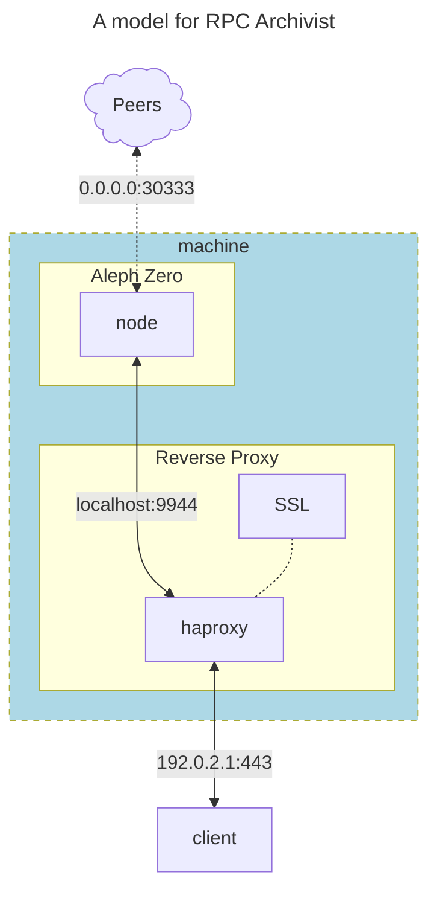
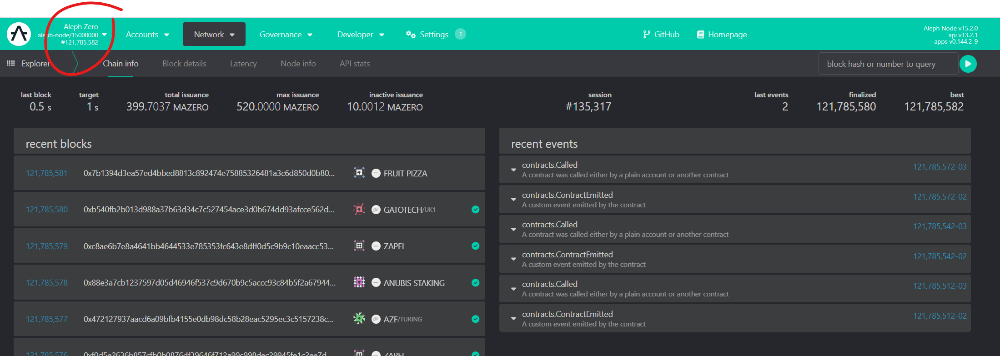
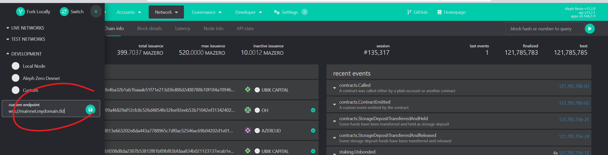
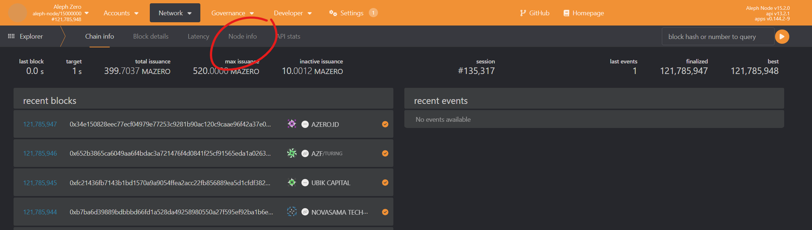
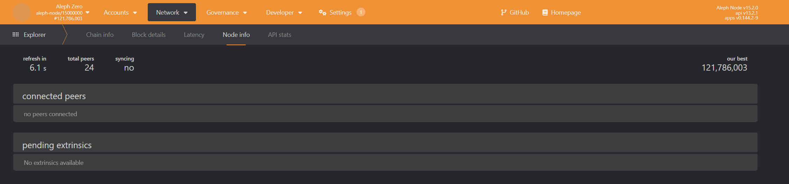

# Archivist Nodes

Current storage needed for running an archival node in Aleph Zero:

- Mainnet: 1.2TB
- Testnet: 1.1TB

:::info
We need you!... If you can commit your time and resources to run an archivist node, please get in contact!!
:::

## What is an Archivist

An Archive node stores all past blocks of the relevant blockchain, with complete state available for every block.

The main purpose of Archive nodes is to be used by utilities, such as block explorers, wallets, discussion forums, etc. which need access to historical information.

These applications often connect and consult the archive nodes via RPC endpoints and WebSocket connections.

To provide archive services under the initiative, you will need to cater for the following use cases:

1. http / https requests.
2. ws / wss sessions.

These will be possible by deploying the following solution per required chain:



In the diagram above, a HAProxy instance will listen to the port 443 for RPC requests and will connect them to the archive nodes listening in port 9944 in the `localhost`, this configuration allows to terminate SSL certificates for an HTTPS (or WSS) connection.

## Configure Archive Service

The configuration of the Aleph Zero node can be adjusted in the systemd service file:

```bash
sudo nano /etc/systemd/system/azero1.service
```

and the recommended binary flags are shown as follows:

```systemd title="/etc/systemd/system/azero1.service"
[Unit]
Description=Aleph Zero Mainnet Node
After=network-online.target
Wants=network-online.target

[Service]
User=azero
Group=azero
ExecStart=/usr/local/bin/aleph-node \
  --name MY_AZERO_ARCHIVE \
  --base-path '/var/lib/aleph-node/azero1' \
  --chain /var/lib/aleph-node/azero1/chainspec.json \
  --node-key-file /var/lib/aleph-node/azero1/p2p_secret \
  --backup-path /var/lib/aleph-node/azero1/backup-stash \
  --no-prometheus \
  --database paritydb \
  --state-pruning archive \
  --blocks-pruning archive \
  --telemetry-url 'wss://telemetry.azero.fans/submit/ 1' \
  --telemetry-url 'wss://telemetry.polkadot.io/submit/ 1' \
  --bootnodes "/dns4/vnode.alephzero.org/tcp/30333/p2p/12D3KooW9qrAFhZA5LWAUpXcQjAEkgt45mzejQNekE9RfJ2Rj7wH /ip4/15.204.109.229/tcp/30333/p2p/12D3KooWSW8Wg81hjowRLd2eCHXtPna3reGUK8iaRJz57jWbSYik /dns/azero.gatotech.network/tcp/33600/p2p/12D3KooWF5ZVJngM62dAFeVLeEY81ZvtRPoH3QTvLsTheCEgyfkW /dns/azero.gatotech.network/tcp/34600/ws/p2p/12D3KooWF5ZVJngM62dAFeVLeEY81ZvtRPoH3QTvLsTheCEgyfkW /dns/azero.gatotech.network/tcp/35600/wss/p2p/12D3KooWF5ZVJngM62dAFeVLeEY81ZvtRPoH3QTvLsTheCEgyfkW" \
  --listen-addr /ip4/0.0.0.0/tcp/30333 \
  --listen-addr /ip4/0.0.0.0/tcp/30333/ws \
  --public-addr /ip4/192.0.2.1/tcp/30333 \
  --public-addr /ip4/192.0.2.1/tcp/30333/ws \
  --public-addr /ip4/192.0.2.1/tcp/30333/wss \
  --pool-limit 8192 \
  --pool-kbytes 20480 \
  --unit-creation-delay 300 \
  --enable-log-reloading \
  --no-mdns \
  --sync full \
  --wasm-execution Compiled \
  --out-peers 20 \
  --in-peers 20 \
  --in-peers-light 100 \
  --max-parallel-downloads 8 \
  --max-blocks-per-request 128 \
  --max-runtime-instances 32 \
  --runtime-cache-size 4 \
  --rpc-max-request-size 16 \
  --rpc-max-response-size 32 \
  --rpc-max-subscriptions-per-connection 2048 \
  --rpc-max-connections 10000 \
  --rpc-external \
  --rpc-methods safe \
  --rpc-cors all \
  --prometheus-external \
  --offchain-worker always \
  --enable-offchain-indexing true


Restart=always
RestartSec=120

[Install]
WantedBy=multi-user.target
```

Note that this service file makes use of the following flags:

- `--state-pruning` and `--block-pruning` must both be set to _`archive`_ for the node to be able so store the whole blockchain and serve historical information right from the genesis block.
- `--listen-addr`: to open the relevant p2p ports in the node, here we have created two IPv4 for both vanilla http & websocket endpoints.
- `--public-addr`: these are the addresses that the node will advertise to the network, note that these have an additional `wss` alternative that will be used for [bootnode](../3-bootnodes/index.md) functionality.
- The rest of the flags are there for convenience and performance.

## Configure HAProxy Service

If not already installed, please follow the following commands to install the latest version of HAProxy

```bash
# Install dependencies
sudo apt install software-properties-common
# Add the repository of the haproxy project
sudo add-apt-repository ppa:vbernat/haproxy-3.2
# Update the database of available packages
sudo apt update
# install haproxy
sudo apt install haproxy
# verify the installation
sudo haproxy -v
```

If HAProxy was correctly installed, the output will be similar to this one:

```text
HAProxy version 3.2.4-1ppa1~noble 2025/08/14 - https://haproxy.org/
Status: long-term supported branch - will stop receiving fixes around Q2 2030.
Known bugs: http://www.haproxy.org/bugs/bugs-3.2.4.html
Running on: Linux 6.8.0-83-generic #83-Ubuntu SMP PREEMPT_DYNAMIC Fri Sep  5 21:46:54 UTC 2025 x86_64
```

By default, HAProxy is not configured to listen on any ports. In this step, and since we are going to configure it as a reverse proxy, we are going to make changes to the default HAProxy configuration.

```bash
# Make a copy of the current configuration for backup
sudo cp -a /etc/haproxy/haproxy.cfg{,.bak}
# Edit the configuration file
sudo nano /etc/haproxy/haproxy.cfg
```

Add the following content to this file, but make sure to use the appropriate user, group, and details for your archive nodes:

```ini title="/etc/haproxy/haproxy.cfg"
###
# HAPROXY CONFIGURATION FILE
###

global

###
# Standard Settings
###

   # Basic configuration
   log /dev/log    local0
   log /dev/log    local1 notice
   chroot /var/lib/haproxy
   stats socket /run/haproxy/admin.sock mode 600 level admin
   stats timeout 30s
   user  haproxy
   group haproxy
   daemon

   # Default SSL material locations
   ca-base /etc/ssl/certs
   crt-base /etc/ssl/private

   # See: https://ssl-config.mozilla.org/#server=haproxy&server-version=2.0.3&config=intermediate
   ssl-default-bind-ciphers ECDHE-ECDSA-AES128-GCM-SHA256:ECDHE-RSA-AES128-GCM-SHA256:ECDHE-ECDSA-AES256-GCM-SHA384:ECDHE-RSA-AES256-GCM-SHA384:ECDHE-ECDSA-CHACHA20-POLY1305:ECDHE-RSA-CHACHA20-POLY1305:DHE-RSA-AES128-GCM-SHA256:DHE-RSA-AES256-GCM-SHA384
   ssl-default-bind-ciphersuites TLS_AES_128_GCM_SHA256:TLS_AES_256_GCM_SHA384:TLS_CHACHA20_POLY1305_SHA256
   ssl-default-bind-options ssl-min-ver TLSv1.2 no-tls-tickets

###
# Extra Settings
###

   # Maximum per-process number of concurrent connections
   maxconn 250000
   # Maximum per-process number of connections per second
   maxconnrate 1000
   # multithread suppport
   nbthread 8
   # Buffer size (in bytes) for cookies. Default value is 16384.
   tune.bufsize 32768
   # Maximum size of the Diffie-Hellman parameters used for generating keys
   tune.ssl.default-dh-param 4096
   # Maximum CPU usage before stopping compression
   maxcompcpuusage 50

###
# HTTP MODE
###

###
# HTTP - Default Values
###

defaults
   log     global
   mode    http
   retries 3
   option  httpslog
   option  dontlognull
   option  forwardfor
   timeout connect         5s
   timeout client          2m
   timeout client-fin      10s
   timeout server          1m
   timeout server-fin      5s
   timeout tunnel          10m
   timeout queue           10s
   timeout http-request    10s
   timeout http-keep-alive 2s
   balance leastconn
   maxconn 250000
   errorfile 400 /etc/haproxy/errors/400.http
   errorfile 403 /etc/haproxy/errors/403.http
   errorfile 408 /etc/haproxy/errors/408.http
   errorfile 500 /etc/haproxy/errors/500.http
   errorfile 502 /etc/haproxy/errors/502.http
   errorfile 503 /etc/haproxy/errors/503.http
   errorfile 504 /etc/haproxy/errors/504.http

###
# HTTP - HTTP listener (auto-redirect to HTTPS)
###

listen li-http
   bind *:80
   http-request redirect scheme https unless { ssl_fc }

###
# HTTP - HTTPS Frontends
###

frontend fe-ssl
   bind *:443 ssl crt /etc/ssl/private

   ## Evaluate ACLs (Access Control Lists) ##

   # Discriminate individual chains
   acl is_azero hdr(host)     -i mainnet.azero.fans  azero.mydomain.tld

   ## Organise backends ##

   # Independent Solochains
   use_backend be-azero-rpc      if is_azero

###
# HTTP - HTTPS Backends
###

# Aleph Zero backends
backend be-azero-rpc
   option http-server-close
   server azero-rpc1 localhost:9944 check inter 10s

####
# END HAPROXY CONFIGURATION FILE
####
```

Now the setup is ready for:

## Adding the SSL certificates

Please store the SSL certificates of all the domains named in the `haproxy.cfg` file in the `/etc/ssl/private` directory.

More details on how to obtain the certificate for `azero.fans` in this [page](./certificates.md).

## Restart the Services

Apply the following commands in the shell to start the services.

```bash
# Restart the reverse proxy service
sudo systemctl restart haproxy
# Clear any previous blockchain database, if needed
sudo rm -r /var/lib/aleph-node/*
# Restart the bootnode service
sudo systemctl restart azero1
```

## Test your Endpoints

Given that your services must cater for both https and websocket users, below is the procedure to test them accordingly

```bash
# Request the following Remote Procedure Call (RPC) to the https endpoint of your node
curl -H "Content-Type: application/json" -d '{"id":1, "jsonrpc":"2.0", "method": "system_health", "params":[]}' https://azero.mydomain.tld/
```

If everything went well, that command should return a response message similar to the one below.

```text
{"jsonrpc":"2.0","result":{"peers":20,"isSyncing":false,"shouldHavePeers":true},"id":1}
```

To test the websocket endpoint, the easiest way is to add it to the `polkadot.{js}` interface and check that the app is connecting to the appropriate chain:

1. Head up to your preferred browser and navigate to the [wallet](https://app.azero.fans/), you will be presented with the initial interface:



1. In the top left corner, click to change the default chain/endpoint connected, this will display a menu showing the options, go to the bottom `DEVELOPMENT` field and enter your endpoint (e.g. wss://rpc.mydomain.tld/polkadot):



3. The new connection will be attempted and, if successful, you will see the updated app showing blockchain information being populated:



4. To obtain a similar information to what was received from the https endpoint, the wss equivalent is shown in the page `Network` -> `Explorer` -> `Node info`:



And finally:

## Announce your Services

Let the administrators of the GeoDNS and Anycast services know when your endpoints are up and running so they can add you to the rotation set.

.-
