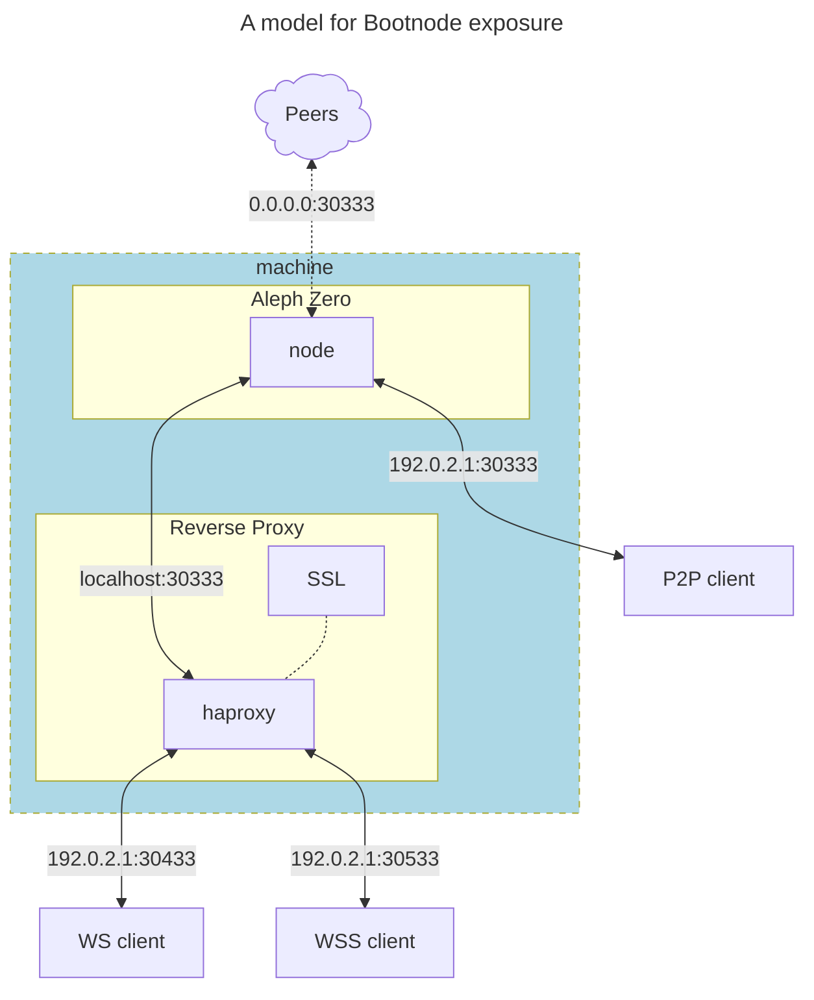

# Bootnodes

The hardware requirements of a bootnode are the lowest of all kind of nodes. Virtually any modest machine that can be permanently connected to the Internet can act as a bootnode!

:::info
We need you!... If you can commit your time and resources to run a bootnode, please get in contact!!
:::

## What is a bootnode

A bootnode is a regular network node that is made available to new nodes to help them discover the rest of the peers in the network.

The details about the public bootnodes of a network are often hard-coded or embedded in the chain specification file and/or its executable binary, however, bootnodes can also be made available separately and added to the binary at time of execution.

To provide bootnode services under this community initiative, you will need to cater for the following two use cases:

1. **Bootstrapping of new nodes starting connection to the network**. For these nodes it would be enough to open the peer-to-peer port (default 30333) port to the public, either directly or through a proxy service to protect the bootnode.
2. **Starting up light-clients**, e.g. `smoldot`. For these nodes you would need to add an SSL certificate to the p2p protocol. This is done first by exposing an unsecure Websocket of the p2p network to the proxy, and allow the proxy to add the SSL certificate and expose it securely to the Internet.

This requirement is illustrated in the diagram below:



Note that the `p2p peers` will connect directly to the node as long as the machine's firewall allows for it and the machine's IP address is publicly accessible. and haproxy is only used to "elevate" the connection from p2p (TCP) to the HTTP protocol so it can accept Websocket (WS) connections. One additional step is to add SSL termination to allow for Secure Websocket (WSS) sessions.

Let's see how this is done in your machine:

## Configure Bootnode Service

The `systemd` service file needs to include all the configuration for the ports in the diagram above, as well as provide public advertisement of the addresses where the services will be available, this is done by specifying the following:

```bash
# Edit the systemd service file to add listening ports and protocols
sudo nano /etc/systemd/system/azero1.service
```

and enter the following sample content for an Aleph Zero bootnode

```systemd title="/etc/systemd/system/azero1.service"
[Unit]
Description=Aleph Zero Mainnet Node
After=network-online.target
Wants=network-online.target

[Service]
User=azero
Group=azero
ExecStart=/usr/local/bin/aleph-node \
  --name MY_AZERO_BOOTNODE \
  --base-path '/var/lib/aleph-node/azero1' \
  --chain /var/lib/aleph-node/azero1/chainspec.json \
  --node-key-file /var/lib/aleph-node/azero1/p2p_secret \
  --backup-path /var/lib/aleph-node/azero1/backup-stash \
  --no-prometheus \
  --database paritydb \
  --state-pruning 256 \
  --blocks-pruning 256 \
  --sync warp \
  --telemetry-url 'wss://telemetry.azero.fans/submit/ 1' \
  --telemetry-url 'wss://telemetry.polkadot.io/submit/ 1' \
  --bootnodes "/dns4/vnode.alephzero.org/tcp/30333/p2p/12D3KooW9qrAFhZA5LWAUpXcQjAEkgt45mzejQNekE9RfJ2Rj7wH /ip4/15.204.109.229/tcp/30333/p2p 12D3KooWSW8Wg81hjowRLd2eCHXtPna3reGUK8iaRJz57jWbSYik /dns/azero.gatotech.network/tcp/33600/p2p/12D3KooWF5ZVJngM62dAFeVLeEY81ZvtRPoH3QTvLsTheCEgyfkW /dns/azero.gatotech.network/tcp/34600/ws/p2p/12D3KooWF5ZVJngM62dAFeVLeEY81ZvtRPoH3QTvLsTheCEgyfkW /dns/azero.gatotech.network/tcp/35600/wss/p2p/12D3KooWF5ZVJngM62dAFeVLeEY81ZvtRPoH3QTvLsTheCEgyfkW" \
  --listen-addr /ip4/0.0.0.0/tcp/30333 \
  --listen-addr /ip4/0.0.0.0/tcp/30333/ws \
  --public-addr /ip4/192.0.2.1/tcp/30333 \
  --public-addr /ip4/192.0.2.1/tcp/30433/ws \
  --public-addr /ip4/192.0.2.1/tcp/30533/wss \
  --ws-external \
  --rpc-external \
  --rpc-methods safe \
  --unit-creation-delay 300 \
  --enable-log-reloading

Restart=always
RestartSec=120

[Install]
WantedBy=multi-user.target
```

Please note that this service file makes use of the following flags:

- `--state-pruning`: a typical value of *`256`* or less is possible for a bootnode, please note that using a value less than 256 does not imply savings of storage space.
- `--sync`: the use of *`warp`* mode is supported for most bootnodes, make use of it and speed up the syncing time!
- `--listen-addr`: to open the relevant p2p ports in the node, here we have created two instances, both IPv4, for vanilla p2p & Websocket p2p.
- `--public-addr`: these are the addresses that the node will advertise to the network, note that although the port is a match for the vanilla p2p service, it is different for the internal websocket (ending in *`/ws`*) that is advertised as secured in another port (ending in *`/wss`*).
- `--ws-external`, `--rpc-external`, and `--rpc-methods safe` are used to restrict the type of commands made available in the **rpc** and **ws** ports
- The rest of the flags are there for convenience and performance.

## Configure HAProxy Service

If not already installed, please follow the following commands to install the latest version of HAProxy

```bash
# Install dependencies
sudo apt install software-properties-common
# Add the repository of the haproxy project
sudo add-apt-repository ppa:vbernat/haproxy-3.2
# Update the database of available packages
sudo apt update
# install haproxy
sudo apt install haproxy
# verify the installation
sudo haproxy -v
```

If HAProxy was correctly installed, the output will be similar to this one:

```text
HAProxy version 3.2.4-1ppa1~noble 2025/08/14 - https://haproxy.org/
Status: long-term supported branch - will stop receiving fixes around Q2 2030.
Known bugs: http://www.haproxy.org/bugs/bugs-3.2.4.html
Running on: Linux 6.8.0-83-generic #83-Ubuntu SMP PREEMPT_DYNAMIC Fri Sep  5 21:46:54 UTC 2025 x86_64
```

By default, HAProxy is not configured to listen on any ports. In this step, since we are going to configure it as a reverse proxy, we are going to make changes to the default HAProxy configuration.

```bash
# Make a copy of the current configuration for backup
sudo cp -a /etc/haproxy/haproxy.cfg{,.bak}
# Edit the configuration file
sudo nano /etc/haproxy/haproxy.cfg
```

Add the following content to this file:

```ini title="/etc/haproxy/haproxy.cfg"
###
# HAPROXY CONFIGURATION FILE
###

global

###
# Standard Settings
###

   # Basic configuration
   log /dev/log    local0
   log /dev/log    local1 notice
   chroot /var/lib/haproxy
   stats socket /run/haproxy/admin.sock mode 600 level admin
   stats timeout 30s
   user  haproxy
   group haproxy
   daemon

   # Default SSL material locations
   ca-base /etc/ssl/certs
   crt-base /etc/ssl/private

   # See: https://ssl-config.mozilla.org/#server=haproxy&server-version=2.0.3&config=intermediate
   ssl-default-bind-ciphers ECDHE-ECDSA-AES128-GCM-SHA256:ECDHE-RSA-AES128-GCM-SHA256:ECDHE-ECDSA-AES256-GCM-SHA384:ECDHE-RSA-AES256-GCM-SHA384:ECDHE-ECDSA-CHACHA20-POLY1305:ECDHE-RSA-CHACHA20-POLY1305:DHE-RSA-AES128-GCM-SHA256:DHE-RSA-AES256-GCM-SHA384
   ssl-default-bind-ciphersuites TLS_AES_128_GCM_SHA256:TLS_AES_256_GCM_SHA384:TLS_CHACHA20_POLY1305_SHA256
   ssl-default-bind-options ssl-min-ver TLSv1.2 no-tls-tickets

###
# HTTP MODE
###

###
# HTTP - Default Values
###

defaults
   log     global
   mode    http
   retries 3
   option  httpslog
   option  dontlognull
   option  forwardfor
   timeout connect         5s
   timeout client          2m
   timeout client-fin      10s
   timeout server          1m
   timeout server-fin      5s
   timeout tunnel          10m
   timeout queue           10s
   timeout http-request    10s
   timeout http-keep-alive 2s
   balance leastconn
   maxconn 250000
   errorfile 400 /etc/haproxy/errors/400.http
   errorfile 403 /etc/haproxy/errors/403.http
   errorfile 408 /etc/haproxy/errors/408.http
   errorfile 500 /etc/haproxy/errors/500.http
   errorfile 502 /etc/haproxy/errors/502.http
   errorfile 503 /etc/haproxy/errors/503.http
   errorfile 504 /etc/haproxy/errors/504.http

####
# HTTP - Bootnodes' listeners over P2P/Websockets
####

# Aleph Zero bootnodes

listen li-azero-boot
   bind *:30433
   bind *:30533 ssl crt /etc/ssl/private
   server azero-boot localhost:30333 check inter 10s

####
# END HAPROXY CONFIGURATION FILE
####
```

Now the setup is ready for:

## Adding the SSL certificates

Please store the SSL certificates of all the domains pointing to the haproxy IP address in the `/etc/ssl/private` directory.

:::warning
If HAproxy does not find the relevant SSL certificate in the indicated directory, the WSS session will not be connected.
:::

## Restart the services

Finally, let's restart the services

```bash
# Restart the reverse proxy service
sudo systemctl restart haproxy
# Clear any previous blockchain database, if needed
sudo rm -r /var/lib/aleph-node/*
# Restart the bootnode service
sudo systemctl restart azero1
# Recover the networkID of the bootnode
sudo journalctl -n 1000 -u azero1 | grep "Local node identity"
```

You will obtain a result like the one below, take note of the code, which is the `networkid` of your bootnode

```text
2023-05-25 23:14:13 🏷  Local node identity is: 12D3KooWK4Esdsg3xxC4RfrDVgcZzExg8Q3Q2G7ABUUitks1w
```

### Build your bootnode's multiaddress

Now it is important that you know how to connect all pieces of information regarding your bootnode so it can be correctly communicated in the network and configured during operations.

The convention we use to build this path structure is called a [multiaddresses](https://docs.libp2p.io/concepts/fundamentals/addressing/) and we are only using a very specific case of this standard.

Again, you need at least two (2x) endpoints for your bootnode, one for TCP connections and one for WSS connections, these two were already introduced in the flag `--public-addr` inside the bootnode's service file [here](#configure-bootnode-service) and now we complement it with the `networkid` obtained in the previous step above:

1. for TCP connections:

```ini
# Structure
/dns/mybootnode.mydomain.tld/tcp/port/p2p/networkid
# Example
/dns/mybootnode.mydomain.tld/tcp/30333/p2p/12D3KooWK4Esdsg3xxC4RfrDVgcZzExg8Q3Q2G7ABUUitks1w
```

2. for WSS connections:

```ini
# Structure
/dns/mybootnode.mydomain.tld/tcp/port/wss/p2p/networkid
# Example
/dns/mybootnode.mydomain.tld/tcp/30533/wss/p2p/12D3KooWK4Esdsg3xxC4RfrDVgcZzExg8Q3Q2G7ABUUitks1w
```

## Test your Bootnode

In order to test your bootnode, you will need:

1. the target multiaddress of your bootnode
   - see previous subtitle [here](#build-your-bootnodes-multiaddress).
2. a cleaned-up version of the appropriate chain specification.
   - all chainspec files are available [here](https://github.com/Cardinal-Cryptography/aleph-node/tree/main/bin/node/src/resources).
   - you need to manually remove the `bootnodes` entry of the chainspecs.
3. a test machine where you can run the executable binary.
   - remember to use the adequate binary for the relevant chainspecs. 

The testing procedure is relatively simple and it utilises the CLI flag `--bootnodes` to pass the target multiaddress to the executable:

```bash
# Testing a bootnode:
# <BINARY> --chain <CHAINSPEC> --bootnodes <MULTIADDR>
#
# This is only an example with additional recommended flags
aleph-node --no-mdns --chain mainnet_chainspec.json --bootnodes "/dns/mybootnode.mydomain.tld/tcp/30333/p2p/12D3KooWK4Esdsg3xxC4RfrDVgcZzExg8Q3Q2G7ABUUitks1w"
```

Let us dive in the recommended command flags:

- `--chain`: please input the full path of your chainspec file.
- `--bootnodes`: in here you specify the multiaddress of the target bootnode you want to test.
- `--no-mdns`: (optional) this could also help mitigating the search of peers in the local network.

After executing such a command, you should see an output like the one below is the bootnode wat set correctly:

```text
(...)
2024-04-26 00:14:10 ⚙️  Syncing, target=#20504263 (6 peers), best: #151731 (0x1a15…be74), finalized #151552 (0xfce1…5cbb), ⬇ 351.9kiB/s ⬆ 18.6kiB/s
2024-04-26 00:14:15 ⚙️  Syncing 589.0 bps, target=#20504264 (6 peers), best: #154678 (0x04fa…5a19), finalized #154624 (0x4043…1ff4), ⬇ 226.9kiB/s ⬆ 2.8kiB/s
2024-04-26 00:14:20 ⚙️  Syncing 580.6 bps, target=#20504265 (6 peers), best: #157581 (0xff28…2ade), finalized #157184 (0x365d…5cc7), ⬇ 251.0kiB/s ⬆ 21.6kiB/s
2024-04-26 00:14:25 ⚙️  Syncing 577.4 bps, target=#20504266 (8 peers), best: #160468 (0x9a9a…13d8), finalized #160256 (0x8154…1770), ⬇ 361.2kiB/s ⬆ 5.8kiB/s
2024-04-26 00:14:40 ⚙️  Syncing 574.6 bps, target=#20504267 (9 peers), best: #169145 (0xd3cd…bdea), finalized #168960 (0x9fe9…e507), ⬇ 319.9kiB/s ⬆ 17.3kiB/s
(...)
```

Please note how the quantity of peers increments, indicating that the node is successfully finding additional nodes to continue with their synchronisation of blocks. This is the expected result!

## Back up your network key

You can already note that the `networkid` code is very important, because this is an unique code that identifies the bootnode in the network, should you ever need to recover your services (because anything happens to the bootnode itself or to the machine hosting it), the new bootnode will obtain a new random `networkid` and every user in the network will receive a message of the broken link:

```text
May 15 10:36:46 dot-boot polkadot[5596]: 2023-05-15 10:36:46 💔 The bootnode you want to connect to at `/ip4/185.127.231.68/tcp/30333/ws/p2p/12D3KooWKvdDyRKqUfSAaUCbYiLwKY8uK3wDWpCuy2FiDLbkPTDJ` provided a different peer ID `12D3KooWFHkJaz1BxqdAjzeLK4xcubxXP25kTaYWZqsJukuex5Ly` than the one you expect `12D3KooWKvdDyRKqUfSAaUCbYiLwKY8uK3wDWpCuy2FiDLbkPTDJ`.
```

And this would require you to create a new Pull Request to the project's Github repository to amend this problem. This is a lengthy process and you will potentially be responsible for flooding the journals with your error and it will be negative not only for your image, but for the reputation of the whole collective, thus please back up your network key as soon as you spin a new bootnode:

```bash title="In the bootnode machine"
# Copy the network keys to your home directory
sudo cp /var/lib/alpeh-node/azero1/chains/mainnet/network/secret_ed25519 ~
# Change owner to your SSH user
sudo chown myself:myself ~/secret_ed25519
```

Now from your local PC:

```bash title="In your local PC"
# Transfer the file securely to local
scp myself@mybootnode.mydomain.tld:~/secret_ed25519 .
```

And store it safely!

## Submit a Pull Request

Now you are ready to include your bootnode in the chain specification of the networks!...

To do that, go to the relevant Github repository (e.g. aleph-node) and identify the correct file containing the chain specifications.

Fork the repository, add your bootnodes and create a Pull Request (PR) for the consideration of the relevant project team.

That is it... Your are now a Bootnode provider!
